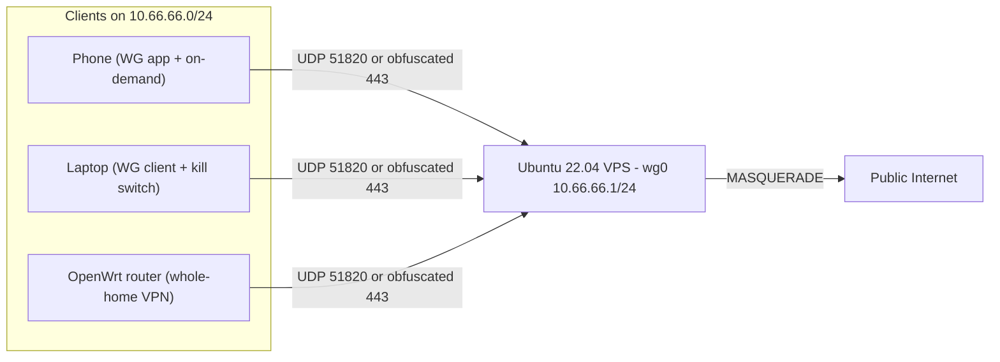

# WireGuard Personal VPN on Ubuntu 22.04 — Full Setup Guide

This guide builds a **full-tunnel** WireGuard VPN on your Ubuntu 22.04 VPS, with clients for **Android/iOS, Windows/macOS/Linux, and OpenWrt**, a **kill switch** on every platform, and **DPI obfuscation** (AmneziaWG primary, udp2raw fallback).

---

## Architecture overview



**Design choices used throughout:**

| Setting | Value |
|---|---|
| Tunnel subnet | `10.66.66.0/24` |
| Server tunnel IP | `10.66.66.1/24` |
| WireGuard port | `51820/udp` |
| Obfuscation port | `443/tcp` (udp2raw faketcp) |
| Client DNS | `1.1.1.1`, `1.0.0.1` |
| Server config | `/etc/wireguard/wg0.conf` |
| Keys | `/etc/wireguard/keys/` |

---

## 1. Prerequisites and assumptions

**You need:**

- A fresh Ubuntu 22.04 VPS with a **public IPv4 address**
- Root or sudo access via SSH
- A domain name pointing to the VPS (optional but recommended — use it as `vpn.example.com` instead of a raw IP)
- WireGuard client apps on your devices

**Before you start, open these ports in your VPS provider's cloud firewall** (AWS Security Group, Hetzner Cloud Firewall, DigitalOcean Cloud Firewall, etc.):

| Port | Protocol | Purpose |
|---|---|---|
| 22 | TCP | SSH |
| 51820 | UDP | WireGuard (direct) |
| 443 | TCP | udp2raw obfuscation (optional) |

Provider-level firewalls sit **in front of** UFW. If you only open ports in UFW but not in the cloud panel, the VPN will not work.

**SSH key login (recommended):**

```bash
# On your local machine — generate a key if you don't have one
ssh-keygen -t ed25519 -C "your@email"

# Copy it to the VPS
ssh-copy-id root@YOUR_VPS_IP
```

---

## 2. VPS preparation

SSH into your VPS and run:

```bash
# Update the system
apt update && apt full-upgrade -y

# Install required packages
apt install -y wireguard wireguard-tools qrencode ufw iptables curl wget

# Set timezone (adjust as needed)
timedatectl set-timezone UTC

# Create directories for keys and client configs
mkdir -p /etc/wireguard/keys /etc/wireguard/clients
chmod 700 /etc/wireguard/keys /etc/wireguard/clients
```

---

## 3. Enable IP forwarding

WireGuard clients need the VPS to forward and NAT their traffic to the internet.

```bash
cat > /etc/sysctl.d/99-wireguard.conf << 'EOF'
net.ipv4.ip_forward=1
net.ipv4.conf.all.forwarding=1
EOF

sysctl --system
```

Verify:

```bash
sysctl net.ipv4.ip_forward
# Expected: net.ipv4.ip_forward = 1
```

---

## 4. Generate server keys

```bash
umask 077
cd /etc/wireguard/keys

wg genkey | tee server.key | wg pubkey > server.pub

# Display keys (save server.pub — you'll need it for client configs)
echo "Server Private Key:"
cat server.key
echo "Server Public Key:"
cat server.pub
```

**Never share `server.key`.** Only the public key goes into client configs.

---

## 5. Find your egress network interface

You need the interface name that faces the public internet (usually `eth0`, `ens3`, or `enp1s0`):

```bash
ip route show default
```

Example output:

```
default via 10.0.0.1 dev eth0 proto static
```

Here, `eth0` is the egress NIC. **Replace `eth0` with your actual interface** in all commands below.

---

## 6. Write the server config

```bash
cat > /etc/wireguard/wg0.conf << 'EOF'
[Interface]
Address = 10.66.66.1/24
ListenPort = 51820
PrivateKey = PASTE_SERVER_PRIVATE_KEY_HERE

# NAT and forwarding rules
PostUp   = iptables -A FORWARD -i wg0 -j ACCEPT; iptables -A FORWARD -o wg0 -j ACCEPT; iptables -t nat -A POSTROUTING -o eth0 -j MASQUERADE
PostDown = iptables -D FORWARD -i wg0 -j ACCEPT; iptables -D FORWARD -o wg0 -j ACCEPT; iptables -t nat -D POSTROUTING -o eth0 -j MASQUERADE

# Peers will be added below
EOF
```

Replace:

- `PASTE_SERVER_PRIVATE_KEY_HERE` → contents of `/etc/wireguard/keys/server.key`
- `eth0` → your actual egress interface

Set permissions:

```bash
chmod 600 /etc/wireguard/wg0.conf
```

---

## 7. Configure the firewall (UFW)

```bash
# Default policies
ufw default deny incoming
ufw default allow outgoing
ufw default allow routed

# Allow SSH (do this BEFORE enabling UFW!)
ufw allow 22/tcp comment 'SSH'

# Allow WireGuard
ufw allow 51820/udp comment 'WireGuard'

# Allow udp2raw obfuscation (optional, for Section 12)
ufw allow 443/tcp comment 'udp2raw obfuscation'

# Allow forwarding from wg0 to the internet
ufw route allow in on wg0 out on eth0

# Enable UFW
ufw enable
ufw status verbose
```

---

## 8. Start WireGuard and verify

```bash
systemctl enable wg-quick@wg0
systemctl start wg-quick@wg0

# Verify interface is up
ip a show wg0
# Expected: inet 10.66.66.1/24

# Verify WireGuard is listening
wg show
# Expected: interface wg0, listening port 51820
```

---

## 9. Add a client (generic recipe)

Run this for **each device** (phone, laptop, router, etc.). Replace `CLIENT_NAME` and `CLIENT_IP`.

```bash
CLIENT_NAME="phone1"
CLIENT_IP="10.66.66.2"   # increment for each client: .3, .4, .5 ...

umask 077
cd /etc/wireguard/keys

# Generate client keypair and pre-shared key
wg genkey | tee ${CLIENT_NAME}.key | wg pubkey > ${CLIENT_NAME}.pub
wg genpsk > ${CLIENT_NAME}.psk

# Read the generated values
CLIENT_PRIV=$(cat ${CLIENT_NAME}.key)
CLIENT_PUB=$(cat ${CLIENT_NAME}.pub)
CLIENT_PSK=$(cat ${CLIENT_NAME}.psk)
SERVER_PUB=$(cat server.pub)
SERVER_IP="YOUR_VPS_PUBLIC_IP_OR_DOMAIN"   # e.g. vpn.example.com

# Create the client config file
cat > /etc/wireguard/clients/${CLIENT_NAME}.conf << EOF
[Interface]
PrivateKey = ${CLIENT_PRIV}
Address = ${CLIENT_IP}/32
DNS = 1.1.1.1, 1.0.0.1

[Peer]
PublicKey = ${SERVER_PUB}
PresharedKey = ${CLIENT_PSK}
Endpoint = ${SERVER_IP}:51820
AllowedIPs = 0.0.0.0/0, ::/0
PersistentKeepalive = 25
EOF

chmod 600 /etc/wireguard/clients/${CLIENT_NAME}.conf

# Add peer to server config
cat >> /etc/wireguard/wg0.conf << EOF

[Peer]
# ${CLIENT_NAME}
PublicKey = ${CLIENT_PUB}
PresharedKey = ${CLIENT_PSK}
AllowedIPs = ${CLIENT_IP}/32
EOF

# Hot-reload server config (does NOT disconnect existing peers)
wg syncconf wg0 <(wg-quick strip wg0)

echo "Client config saved to: /etc/wireguard/clients/${CLIENT_NAME}.conf"
```

**Suggested IP assignments:**

| Client | IP |
|---|---|
| phone1 | 10.66.66.2 |
| laptop1 | 10.66.66.3 |
| router1 | 10.66.66.4 |
| phone2 | 10.66.66.5 |

---

## 10. Per-platform client setup

### Android / iOS

**Generate a QR code on the server:**

```bash
qrencode -t ansiutf8 < /etc/wireguard/clients/phone1.conf
```

**Android:**

1. Install [WireGuard from Google Play](https://play.google.com/store/apps/details?id=com.wireguard.android)
2. Tap **+** → **Scan from QR code**
3. Scan the QR code from your terminal
4. Toggle the tunnel **ON**
5. Kill switch: Settings → **Block connections without VPN** (Android 8+)

**iOS:**

1. Install [WireGuard from the App Store](https://apps.apple.com/app/wireguard/id1441195209)
2. Tap **+** → **Create from QR code**
3. Scan the QR code
4. Toggle the tunnel **ON**
5. Kill switch: Edit tunnel → enable **On Demand** → set to **Always On**
6. iOS Settings → General → VPN & Device Management → ensure WireGuard is active

**Transfer config file instead of QR (alternative):**

```bash
# On your local machine
scp root@YOUR_VPS_IP:/etc/wireguard/clients/phone1.conf ~/phone1.conf
# Then import the file in the WireGuard app
```

---

### Windows

1. Download [WireGuard for Windows](https://www.wireguard.com/install/)
2. Install and open the app
3. Click **Add Tunnel** → **Import tunnel(s) from file**
4. Select your `laptop1.conf`
5. Click **Activate**
6. **Kill switch:** Edit tunnel → check **Block untunneled traffic (kill-switch)**
7. **DNS leak fix:** Edit tunnel → check **Force network requests to DNS only on the VPN interface**

---

### macOS

1. Install [WireGuard from the Mac App Store](https://apps.apple.com/app/wireguard/id1451685025)
2. Click **Import tunnel(s) from file** → select `laptop1.conf`
3. Click **Activate**
4. **Kill switch:** Edit tunnel → check **Block untunneled traffic (kill-switch)**

---

### Linux (laptop/desktop)

```bash
# Install WireGuard
sudo apt install -y wireguard

# Copy config from VPS
scp root@YOUR_VPS_IP:/etc/wireguard/clients/laptop1.conf /etc/wireguard/wg0.conf
sudo chmod 600 /etc/wireguard/wg0.conf

# Add kill switch to the client config (see Section 11 for details)
sudo nano /etc/wireguard/wg0.conf

# Enable and start
sudo systemctl enable wg-quick@wg0
sudo systemctl start wg-quick@wg0

# Verify
sudo wg show
curl ifconfig.me   # Should show your VPS IP
```

---

### OpenWrt (whole-home VPN)

**Install packages** (via SSH on the router or LuCI → System → Software):

```bash
opkg update
opkg install wireguard-tools kmod-wireguard luci-app-wireguard luci-proto-wireguard
```

**Via LuCI web UI:**

1. Go to **Network → Interfaces → Add new interface**
2. Name: `vpn`, Protocol: **WireGuard VPN**
3. Paste the contents of your `router1.conf` into the config fields:
   - Private Key → `[Interface] PrivateKey`
   - Listen Port → leave blank (client mode)
   - IP Addresses → `10.66.66.4/32`
   - Peers → add one peer with server PublicKey, PSK, Endpoint, AllowedIPs `0.0.0.0/0`
4. **Firewall Settings tab:** assign to a new zone called `vpn`
5. Save & Apply

**Firewall kill switch (whole-home):**

1. Go to **Network → Firewall → General Settings**
2. Under **Zones**, find `lan → wan` forwarding and **remove/disable it**
3. Add forwarding: `lan → vpn` (allow)
4. Save & Apply

Now all LAN traffic routes through the VPN. If the tunnel drops, LAN devices lose internet (kill switch behavior).

**Persistent keepalive** is critical on OpenWrt since it's behind NAT:

```
PersistentKeepalive = 25
```

---

## 11. Kill switch deep-dive

A kill switch blocks all traffic if the VPN tunnel drops, preventing your real IP from leaking.

### Mobile (Android / iOS)

- **Android:** WireGuard app → Settings → **Block connections without VPN**
- **iOS:** Edit tunnel → **On Demand** → Always On

### Windows / macOS

- Edit tunnel → check **Block untunneled traffic (kill-switch)**
- Windows additionally: check **Force network requests to DNS only on the VPN interface**

### Linux (nftables kill switch)

Add these lines to your client `/etc/wireguard/wg0.conf` under `[Interface]`:

```ini
PostUp   = nft add table inet wg_killswitch; nft add chain inet wg_killswitch output { type filter hook output priority 0 \; policy drop \; }; nft add rule inet wg_killswitch output oifname "lo" accept; nft add rule inet wg_killswitch output oifname "wg0" accept; nft add rule inet wg_killswitch output ip daddr YOUR_VPS_IP udp dport 51820 accept; nft add rule inet wg_killswitch output ip6 daddr YOUR_VPS_IP udp dport 51820 accept
PreDown  = nft delete table inet wg_killswitch
```

Replace `YOUR_VPS_IP` with your VPS public IP. This allows:

- Loopback (`lo`)
- All traffic on `wg0`
- The WireGuard handshake to the server (so the tunnel can reconnect)

Everything else is dropped.

Reload after editing:

```bash
sudo systemctl restart wg-quick@wg0
```

### OpenWrt

Removing `lan → wan` forwarding (Section 10) is the whole-home kill switch. No internet reaches WAN directly — only through the VPN tunnel.

---

## 12. Obfuscation layer (bypass DPI)

Standard WireGuard UDP traffic can be detected and blocked by Deep Packet Inspection (DPI) on restrictive networks (hotels, some ISPs, certain countries). Two options:

---

### Option A — AmneziaWG (recommended, all platforms)

AmneziaWG is a WireGuard fork that adds traffic-shaping parameters to make packets look like random noise. It works on Android, iOS, Windows, macOS, and Linux.

**Install on the VPS:**

```bash
# Add Amnezia PPA
add-apt-repository ppa:amnezia/ppa -y
apt update
apt install -y amneziawg amneziawg-tools

# Stop standard WireGuard
systemctl stop wg-quick@wg0
systemctl disable wg-quick@wg0
```

**Update server config** — add obfuscation parameters to `[Interface]` in `/etc/wireguard/wg0.conf`:

```ini
[Interface]
Address = 10.66.66.1/24
ListenPort = 51820
PrivateKey = YOUR_SERVER_PRIVATE_KEY
Jc = 4
Jmin = 40
Jmax = 70
S1 = 50
S2 = 60
H1 = 1234567890
H2 = 9876543210
H3 = 1122334455
H4 = 5544332211

PostUp   = iptables -A FORWARD -i wg0 -j ACCEPT; iptables -A FORWARD -o wg0 -j ACCEPT; iptables -t nat -A POSTROUTING -o eth0 -j MASQUERADE
PostDown = iptables -D FORWARD -i wg0 -j ACCEPT; iptables -D FORWARD -o wg0 -j ACCEPT; iptables -t nat -D POSTROUTING -o eth0 -j MASQUERADE
```

**Generate consistent obfuscation values** (use the same values on server and all clients):

```bash
# Generate random H values (keep these consistent across all configs!)
echo "H1 = $(shuf -i 1000000000-9999999999 -n 1)"
echo "H2 = $(shuf -i 1000000000-9999999999 -n 1)"
echo "H3 = $(shuf -i 1000000000-9999999999 -n 1)"
echo "H4 = $(shuf -i 1000000000-9999999999 -n 1)"
```

**Start with AmneziaWG:**

```bash
systemctl enable awg-quick@wg0
systemctl start awg-quick@wg0
awg show
```

**Update all client configs** — add the same `Jc`, `Jmin`, `Jmax`, `S1`, `S2`, `H1`–`H4` values under `[Interface]`.

**Client apps for AmneziaWG:**

- **Android/iOS/Windows/macOS:** [AmneziaVPN app](https://amnezia.org/) — import your config or connect manually
- **Linux:** use `awg-quick@wg0` instead of `wg-quick@wg0`
- **OpenWrt:** standard WireGuard packages won't work with AmneziaWG params — use AmneziaVPN app on individual devices instead, or compile AmneziaWG for OpenWrt

---

### Option B — udp2raw faketcp on port 443 (fallback)

Wraps WireGuard UDP in fake TCP packets on port 443, making traffic look like HTTPS. Works on Windows, Android, and Linux. **No usable iOS client** — use AmneziaWG on iOS.

**Install udp2raw on the VPS:**

```bash
cd /tmp
wget https://github.com/wangyu-/udp2raw/releases/download/20230206.0/udp2raw_binaries.tar.gz
tar xzf udp2raw_binaries.tar.gz
cp udp2raw_amd64 /usr/local/bin/udp2raw
chmod +x /usr/local/bin/udp2raw

# Generate a shared secret
UDP2RAW_SECRET=$(openssl rand -hex 16)
echo "udp2raw secret: $UDP2RAW_SECRET"
# Save this — you need it on every client
```

**Create a systemd service:**

```bash
cat > /etc/systemd/system/udp2raw.service << EOF
[Unit]
Description=udp2raw WireGuard obfuscation
After=network.target

[Service]
ExecStart=/usr/local/bin/udp2raw -s -l 0.0.0.0:443 -r 127.0.0.1:51820 -k ${UDP2RAW_SECRET} --raw-mode faketcp -a
Restart=always
RestartSec=3

[Install]
WantedBy=multi-user.target
EOF

systemctl daemon-reload
systemctl enable udp2raw
systemctl start udp2raw
systemctl status udp2raw
```

**Client-side (Linux example):**

```bash
# Download udp2raw for your platform from:
# https://github.com/wangyu-/udp2raw/releases

# Run udp2raw client (keep this running in a terminal or as a service)
./udp2raw -c -l 127.0.0.1:51820 -r YOUR_VPS_IP:443 -k YOUR_UDP2RAW_SECRET --raw-mode faketcp -a
```

**Update client WireGuard config** — change the Endpoint to point at the local udp2raw listener:

```ini
Endpoint = 127.0.0.1:51820
```

WireGuard connects to localhost; udp2raw wraps it in fake TCP and sends it to the VPS on port 443.

**Windows client:**

1. Download `udp2raw_windows` from the releases page
2. Run in a Command Prompt (as Administrator):

   ```
   udp2raw.exe -c -l 127.0.0.1:51820 -r YOUR_VPS_IP:443 -k YOUR_SECRET --raw-mode faketcp -a
   ```

3. Set WireGuard Endpoint to `127.0.0.1:51820`

---

## 13. Verification and leak tests

Run these **with the VPN connected** on each client:

```bash
# 1. Confirm your public IP is the VPS IP
curl ifconfig.me
curl ipinfo.io/ip

# 2. Confirm DNS is going through the tunnel
# Visit: https://dnsleaktest.com — run Extended Test
# All DNS servers shown should be Cloudflare (1.1.1.1) or your chosen DNS

# 3. Check for IPv6 leaks
# Visit: https://ipv6leak.com
# Should show no IPv6 address (or your VPS IPv6 if configured)

# 4. WebRTC leak check
# Visit: https://browserleaks.com/webrtc
# Should not reveal your real local IP

# 5. On the server — confirm active peer
wg show
# Look for: latest handshake: X seconds ago, transfer: X received, Y sent
```

**Expected `wg show` output on server:**

```
interface: wg0
  public key: SERVER_PUBLIC_KEY
  listening port: 51820

peer: CLIENT_PUBLIC_KEY
  preshared key: (hidden)
  endpoint: CLIENT_REAL_IP:PORT
  allowed ips: 10.66.66.2/32
  latest handshake: 45 seconds ago
  transfer: 2.14 MiB received, 891.23 KiB sent
```

---

## 14. Day-2 operations

### Add a new client

Repeat Section 9 with a new `CLIENT_NAME` and increment the IP.

### Remove a client

```bash
# Remove the [Peer] block from /etc/wireguard/wg0.conf
nano /etc/wireguard/wg0.conf

# Hot-reload
wg syncconf wg0 <(wg-quick strip wg0)

# Optionally delete client files
rm /etc/wireguard/keys/CLIENT_NAME.*
rm /etc/wireguard/clients/CLIENT_NAME.conf
```

### View live connections

```bash
wg show                    # all peers and handshakes
watch -n 5 wg show         # refresh every 5 seconds
journalctl -u wg-quick@wg0 -f   # live logs
```

### Backup WireGuard config

```bash
tar czf /root/wireguard-backup-$(date +%Y%m%d).tar.gz /etc/wireguard/
# Download to your local machine:
# scp root@YOUR_VPS_IP:/root/wireguard-backup-*.tar.gz ~/
```

Store backups securely — they contain all private keys.

### Enable automatic security updates

```bash
apt install -y unattended-upgrades
dpkg-reconfigure -plow unattended-upgrades
# Select "Yes" when prompted
```

### Restart WireGuard after a reboot

WireGuard starts automatically via `systemctl enable wg-quick@wg0`. After a VPS reboot:

```bash
systemctl status wg-quick@wg0
wg show
```

---

## 15. Troubleshooting

### No handshake (client can't connect)

**Checklist:**

```bash
# 1. Is WireGuard running on the server?
systemctl status wg-quick@wg0
wg show

# 2. Is the port open in UFW?
ufw status | grep 51820

# 3. Is the port open in your VPS provider's cloud firewall?
# Check AWS Security Group / Hetzner Cloud Firewall / DO Cloud Firewall

# 4. Is the client's public key in wg0.conf?
grep -A3 "CLIENT_NAME" /etc/wireguard/wg0.conf

# 5. Can the client reach the VPS at all?
# From client machine:
ping YOUR_VPS_IP
nc -vzu YOUR_VPS_IP 51820   # UDP port test
```

**Common causes:**

- Cloud provider firewall blocking UDP 51820 (most common)
- Wrong server public key in client config
- Client's public key not added to server, or wrong AllowedIPs on server peer
- VPS provider blocking outbound UDP (rare; try obfuscation)

---

### Handshake works but no internet

```bash
# 1. Is IP forwarding enabled?
sysctl net.ipv4.ip_forward   # must be 1

# 2. Is MASQUERADE rule present?
iptables -t nat -L POSTROUTING -n -v
# Should show MASQUERADE on eth0

# 3. Is the egress interface correct in wg0.conf?
ip route show default   # compare with eth0 in PostUp line

# 4. Is UFW allowing routed traffic?
ufw status verbose | grep wg0

# 5. From client — can you ping the server's tunnel IP?
ping 10.66.66.1
```

**Fix missing MASQUERADE:**

```bash
# Manually add (replace eth0)
iptables -t nat -A POSTROUTING -o eth0 -j MASQUERADE
iptables -A FORWARD -i wg0 -j ACCEPT
iptables -A FORWARD -o wg0 -j ACCEPT
```

---

### Slow or flaky connection / MTU issues

WireGuard adds ~60 bytes of overhead. Some networks have low MTU paths.

Add to client `[Interface]`:

```ini
MTU = 1280
```

Or test the path MTU from the client:

```bash
# Find max MTU (run with VPN connected)
ping -M do -s 1372 10.66.66.1
# Reduce -s value until ping succeeds, then set MTU = (value + 28)
```

---

### DNS leaks (Windows especially)

In the WireGuard for Windows app:

1. Edit tunnel
2. Check **Force network requests to DNS only on the VPN interface**
3. Ensure `DNS = 1.1.1.1, 1.0.0.1` is in the client config

Verify at https://dnsleaktest.com after connecting.

---

### WireGuard works but stops after VPS reboot

```bash
systemctl status wg-quick@wg0
# If failed:
journalctl -u wg-quick@wg0 --no-pager -n 50

# Re-enable if needed
systemctl enable wg-quick@wg0
systemctl start wg-quick@wg0
```

Common post-reboot issue: egress interface name changed (e.g. `eth0` → `ens3`). Update `PostUp`/`PostDown` in `wg0.conf`.

---

### Obfuscation not working

**AmneziaWG:**

- Ensure `Jc/Jmin/Jmax/S1/S2/H1-H4` values are **identical** on server and client
- Use `awg-quick@wg0` not `wg-quick@wg0` on the server
- Use AmneziaVPN app on mobile/desktop clients

**udp2raw:**

- Confirm udp2raw service is running: `systemctl status udp2raw`
- Confirm port 443/tcp is open in cloud firewall and UFW
- Client must run udp2raw **before** activating WireGuard
- WireGuard client Endpoint must be `127.0.0.1:51820` (local udp2raw listener)

---

## Quick reference card

```bash
# Server status
wg show
systemctl status wg-quick@wg0

# Add client (after running Section 9 script)
wg syncconf wg0 <(wg-quick strip wg0)

# View connected peers with traffic
watch -n 2 'wg show | grep -A5 "peer"'

# Restart WireGuard
systemctl restart wg-quick@wg0

# Backup
tar czf ~/wg-backup.tar.gz /etc/wireguard/

# Client: test IP
curl ifconfig.me
```

---

That covers the full setup from a fresh Ubuntu 22.04 VPS to a working, kill-switch-protected, DPI-resistant personal VPN.
